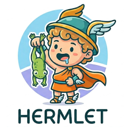

## Hermlet: Hermes Agent + SilverBullet Wiki

This repository contains the orchestration configuration for a "Living LLM Wiki" deployment.

The intended use is for a "single user" system running [Docker Desktop](https://www.docker.com/products/docker-desktop/) to locally host [hermes](https://get-hermes.ai/), [hermes-agent web-dashboard](https://hermes-agent.nousresearch.com/docs/user-guide/features/web-dashboard), [hermes-webui](https://github.com/nesquena/hermes-webui), and [SilverBullet](https://silverbullet.md/) to implement a Karpathy-style [LLM Wiki](https://gist.github.com/karpathy/442a6bf555914893e9891c11519de94f) with a local Ollama-hosted LLM.

The example `initial_prompt.md` and `HERMES.md` may be used to guide the agent to create a specific workflow based on a specific productivity philosophy. You are encouraged to customize these files for your own needs.

The docker compose YAML file is a modification of [docker-compose.three-container.yml](https://github.com/nesquena/hermes-webui/blob/master/docker-compose.three-container.yml) 
from [hermes-webui](https://github.com/nesquena/hermes-webui).

## Architecture Overview

The system is composed of four interacting services, all containerized via Docker Compose for isolation and portability:

1.  **hermes-agent**: The intelligent "brain." An agentic gateway that processes tasks, manages tools, and executes the automated integration workflow.
2.  **hermes-dashboard**: A monitoring interface for real-time agent activity, session tracking, and resource usage.
3.  **hermes-webui**: The primary human-AI interface for chat and task delegation.
4.  **silverbullet**: A highly extensible, Markdown-based personal knowledge management (PKM) system.

All services share a persistent, version-controlled configuration and a common "workspace" for both long-term memory (the Wiki) and the incoming data stream (the Inbox).

---

## Core Workflow: The "Living Wiki" Inbox

The central innovation of this setup is the automated integration of information.

1.  **The Inbox (`/workspace/raw`)**: Users drop documents (MD, TXT, HTML, etc.) into the `raw` directory.
2.  **The Integrator**: Hermes monitors this directory. It identifies new files, extracts their textual content, and transforms them into Markdown for viewing and editing in SilverBullet.
3.  **The Wiki (`/workspace/wiki`)**: The processed content is moved into the SilverBullet wiki using a strict `snake_case.md` naming convention, ensuring a clean, searchable, and interlinked "wiki graph."

---

## Configuration & Deployment

### 1. Configuration
The system's behavior (including the connection to your local **Ollama** instance) is controlled via the file: `config/hermes.env`.

By mounting this file as a **bind mount** into the `hermes-agent` container, we ensure that:
- The configuration is persistent across container recreations.
- The setup is "infrastructure as code" (IaC) compliant.
- The agent's connection to your local LLM is always accurate and easily adjustable.

**To update your model or API key:**
Edit `config/hermes.env` on your host machine and restart the containers. You may also need to update the `config.yaml` in the Hermes Dashboard. See "Configure Model (Ollama) in the Dashboard" and "Test hermes-webui" below for details, as the model name is set in two other places.

### 2. Quick Start
Clone this repository and enter the `hermlet` folder:

```bash
mkdir -p ~/workspace/{raw,wiki,templates}
git clone https://github.com/brianhigh/hermlet.git
cd hermlet
cp eat_that_frog.md ~/workspace/wiki/
cp HERMES.md ~/workspace/
```

Ensure Docker Desktop is running. From the `hermlet` directory, run:

```bash
docker compose up -d
```

### 3. Deployment Requirements
- **Docker Desktop** (Windows, Mac, or Linux)
- **Ollama** running locally with the desired model (e.g., `gemma4:26b`)
- **Network Access**: The services have been configured for local access only. However, as a precaution, ensure your OS firewall is enabled and blocks inbound network access to the following TCP ports (allowing localhost access only):
  - `3000` (SilverBullet Wiki)
  - `8787` (Hermes WebUI)
  - `9119` (Hermes Dashboard)
  - `8642` (Hermes Agent Gateway)
  - `11434` (Ollama API)

---

## Security & Isolation

- **Filesystem Isolation**: The agent is restricted to the `/workspace` directory and the `.hermes/.env` file. It cannot see or touch the rest of your host system.
- **Read-Only Ingress**: The `/workspace/raw` directory is mounted as **read-only** to the `hermes-agent` container, preventing accidental or malicious modification of incoming data during the processing stage.
- **Network Lockdown**: The `docker-compose.yml` is configured to bind all services to `127.0.0.1`, ensuring they are only accessible from your local machine and not exposed to the internet or your local network.

For details, see "Test the Ingestion Workflow" later in this README, as it involves some additional setup.

---

## Methodology: "Eat That Frog!"

This system is designed to implement Brian Tracy's [Eat That Frog!](https://www.briantracy.com/blog/time-management/the-truth-about-frogs/) productivity philosophy. By automating the mundane task of information organization, the agent allows you to focus on your most important, high-impact "A1" tasks.

To guide your Hermes agent to follow this approach, you may use the example `initial_prompt.md` as a starting point. It refers to `HERMES.md` and `wiki/eat_that_frog.md`, which you may customize as needed.

## Web Applications 

### Access

The URLs to access the applications in this system will be shown in Docker Deskop under the Container -> Ports column with clickable links to open the various services in your web browser. For reference, these are:

| Name             |          URL           | Use                             | 
| ---------------- | ---------------------- | ------------------------------- |
| hermes-agent     | http://127.0.0.1:8642  | **ignore**                      |
| silver-bullet-1  | http://127.0.0.1:3000  | SilverBullet Wiki               |
| hermes-webui     | http://127.0.0.1:8787  | Hermes WebUI (chat, etc.)       |
| hermes-dashboard | http://127.0.0.1:9119  | Hermes Dashboard (config, etc.) |

### Setup and Testing

#### Test the wiki

Go to http://127.0.0.1:3000/, login, and make sure it's working okay. You should see an index page with various sections, with "Recently modified pages" the bottom. In that section, you should see a link to `eat_that_frog`. The example `initial_prompt.md` references that wiki page.

#### Configure Model (Ollama) in the Dashboard

Go to the hermes-agent web dashboard "config" page at http://127.0.0.1:9119/config and press the `<> YAML` button.

To use locally-hosted Ollama as your model provider, paste this under "Model Configuration" in place of what's already there:

```
model:
  default: gemma4:26b
  api_key: ollama
  base_url: http://host.docker.internal:11434/v1
  provider: auto
```

Edit for your own situation (like a different model). For reference, see: https://hermes-agent.nousresearch.com/docs/user-guide/configuring-models

Press the `SAVE` button.

#### Test hermes-webui

Go here: http://localhost:8787/

Select the model you configured in the web dashboard from the model \[\#\] pick-list at the bottom of the "Message Hermes..." chat box. It should have a "PRIMARY (AUTO)" label next to it. 

Then enter this (below) into the `CHAT`, or select it from the prompt choices listed:

```
What files are in this workspace?
```

If the results looks right, then you can start using it as intended. For example, paste in the contents of `initial_prompt.md` and edit to match your situation before pressing the `(↑)` button on the right side of the chat input box.

#### Test the Ingestion Workflow

If you choose to use the `initial_prompt.md`, your Hermes agent may automate an ingestion workflow. You will likely need to chat with your Hermes agent to get this workflow working properly, as it will need to create new skills. If the workflow automation does not work correctly at first, chat and test until you are satisfied with the results.

### Ollama model idle timeout (optional)

When you resume chatting after a few minutes of idle time, you may find an annoying delay before the model responds. This occurs when Ollama removes your model from VRAM. The delay from reloading the model can be lengthy, especially with larger models. To address this, increase the idle timeout so the model stays in memory longer.

#### Windows

If you are running Ollama on Windows, you can increase the model idle timeout with this PowerShell command:

```powershell
[System.Environment]::SetEnvironmentVariable("OLLAMA_KEEP_ALIVE", "10m", "User")
```

This is a persistent setting. However, you will need to completely shut down Ollama and restart it for the change to take effect.	

#### Mac/Linux

Similarly, this Bash command sets the environment variable on Mac/Linux:

```bash
export OLLAMA_KEEP_ALIVE=10m
```

This is not persistent unless you add it to `~/.bashrc`, `~/.bash_profile`.

For more information, see: https://markaicode.com/ollama-keep-alive-memory-management/
